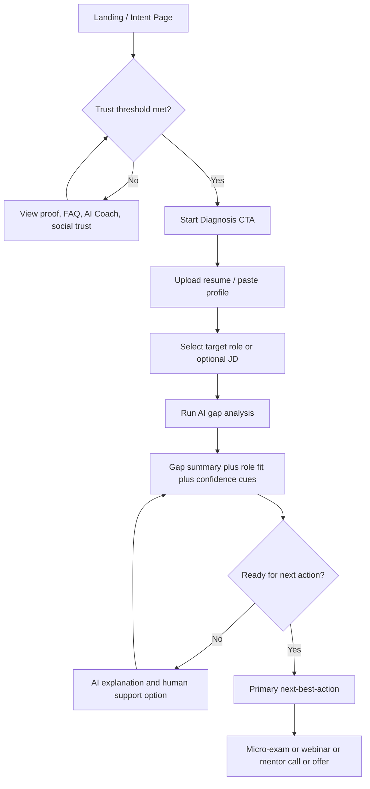
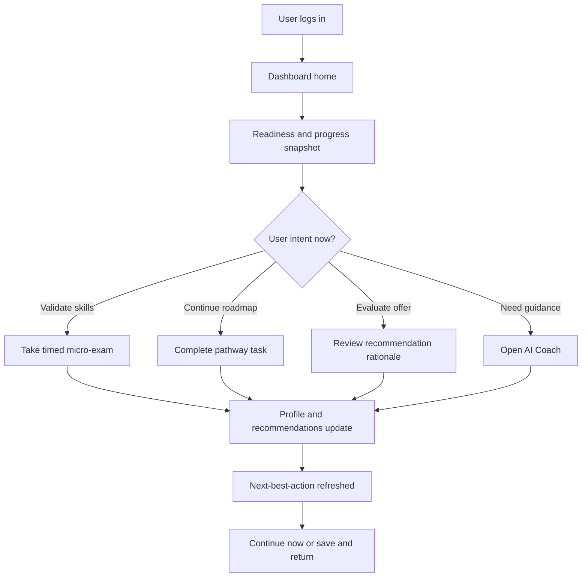
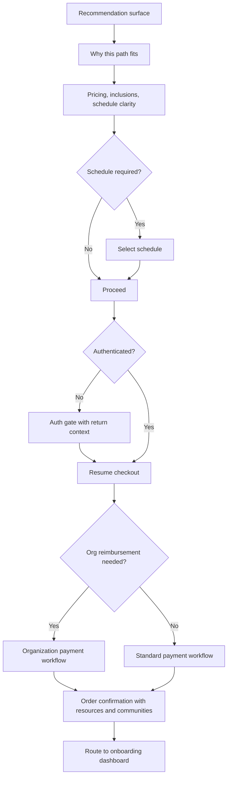

---

## stepsCompleted: [1, 2, 3, 4, 5, 6, 7, 8, 9, 10, 11, 12, 13, 14]

lastStep: 14
inputDocuments:

- "c:/Users/dhire/OneDrive/Documents/mybmadproj/_bmad-output/planning-artifacts/prd-agile-forum.md"
- "c:/Users/dhire/OneDrive/Documents/mybmadproj/_bmad-output/planning-artifacts/epics-agile-forum.md"
- "c:/Users/dhire/OneDrive/Documents/mybmadproj/_bmad-output/planning-artifacts/product-brief-agile-forum.md"

# UX Design Specification mybmadproj

**Author:** Dhirender
**Date:** 2026-05-27

---

## Executive Summary

### Project Vision

The Agile Forum UX is designed as a confidence engine for career progression: users should move from uncertainty to a clear, trusted next action through a guided flow of diagnosis, roadmap, validation, and conversion. The experience must feel mentor-like and outcome-oriented while preserving compliance and credibility, especially around claims, pricing, and recommendation rationale. Instead of presenting fragmented course discovery, the interface should orchestrate one coherent journey that continuously answers: where am I now, what should I do next, and which offer is best for me.

### Target Users

Primary users include career switchers, practicing Agile professionals, IT professionals pivoting into Agile/Product roles, and entry-level learners seeking structured guidance. Secondary operational users include internal marketing/ops/admin stakeholders who govern campaigns, content quality, and conversion health. UX priorities should favor users with moderate digital fluency on mobile-first interactions, while keeping advanced paths (dashboard analytics, role transitions, admin controls) discoverable and manageable.

### Key Design Challenges

The main challenge is balancing depth and clarity: the product includes rich diagnostics, role transitions, assessments, webinars, commerce variants, and trust governance, but the user journey must remain simple and decisive. A second challenge is reducing decision fatigue while preserving transparency for high-stakes purchases through consistent pricing, clear labels (free vs paid exams), and evidence-backed trust surfaces. A third challenge is maintaining continuity and confidence across acquisition, diagnosis, checkout, and post-purchase learning loops without dead ends, especially during legacy replacement and multi-channel re-entry.

### Design Opportunities

A guided "next best action" UX across every page can become a differentiator by turning complexity into momentum. The learner dashboard can create durable engagement by combining visual skill snapshots, accessible alternatives, micro-exam loops, and saved/bookmarked choices in one personal cockpit. Trust-forward design patterns (proof context, compliant claims framing, social validation, and clear support escalation) can materially improve conversion confidence while also strengthening long-term brand credibility.

## Core User Experience

### Defining Experience

The core experience is Diagnose -> Recommend -> Guide -> Practice -> Improve -> Advance. The product must feel like an AI-guided professional growth system, not an LMS catalog. The primary loop to perfect is: user submits context (resume/goals/JD), receives a credible gap diagnosis, and gets one clear next action that moves their career forward.

### Platform Strategy

Primary platform is mobile-first responsive web with desktop depth for dashboards, planning, and comparisons. Launch priority segment is working professionals transitioning into Scrum Master, Product Owner, Product Manager, Agile, SAFe, and leadership roles. Mobile information architecture should provide 1-2 tap access to diagnosis, resume upload, skill gap analysis, personalized learning path, continue learning, AI coach, webinar join, and mentor call booking. Suggested bottom navigation is Home, Diagnose, Learn, AI Coach, and Profile.

### Effortless Interactions

Diagnosis must start fast with minimal cognitive load. Resume upload and role targeting should feel guided and calm. Results should convert analysis into an actionable path rather than an information dump. Every major screen should expose a clear next-best-action CTA. AI Coach should remain persistently available as a context-aware fallback. Urgency should be action-oriented and empowering, never manipulative.

### Critical Success Moments

The key success moment is when a user feels: "I finally know where I stand, what I'm missing, and exactly what to do next." The first diagnosis outcome should shift the user from confusion to clarity. Recommendation moments should create confidence through clear rationale and trust signals. The first completed action (micro-exam, webinar, mentor call, or plan progress) should create momentum. Any failure in diagnosis clarity or next-step guidance is make-or-break.

### Experience Principles

Transformation over transaction: design for career progress, not course browsing. Clarity first: compress complexity into understandable, role-specific guidance. Trust by design: avoid fake urgency, popup overload, and CTA clutter. Progressive momentum: each interaction should naturally unlock the next. Human plus intelligent tone mix should be Mentor/Coach 45 percent, Expert/Data 35 percent, and Peer Guide 20 percent. Brand expression should be confidently modern yet non-salesy, at approximately 6.5-7.5 out of 10 boldness.

## Desired Emotional Response

### Primary Emotional Goals

The primary emotional goal is clarity that converts into confident action. Users should feel: "I finally know where I stand, what I'm missing, and exactly what to do next." A secondary goal is momentum, where each interaction encourages continued progress. Productive urgency is useful only when it remains empowering, transparent, and user-controlled.

### Emotional Journey Mapping

At discovery, users should move from skepticism to relevance, feeling the platform is built for their career transition context. During diagnosis, they should move from confusion to clarity through understandable gap analysis. At recommendation, they should move from uncertainty to confidence with clear rationale and trust cues. At first action (exam, webinar, call, or enrollment), they should move from hesitation to momentum. On return visits, they should feel continuity and progress rather than restart fatigue. During error or failure states, they should move from anxiety to safety through clear recovery paths and support access.

### Micro-Emotions

The most important micro-emotional shifts are confidence over confusion, trust over skepticism, calm urgency over manipulative pressure, accomplishment over frustration, and support over isolation. For conversion and long-term retention, confidence, trust, and accomplishment are the highest-priority emotional signals.

### Design Implications

To create clarity, design should use progressive disclosure, plain-language summaries, and one dominant next-best-action at each stage. To build confidence, recommendation rationale should be visible, role-specific, and tied to progress indicators. To reinforce trust, pricing consistency, compliant claims framing, and contextual proof should appear across conversion surfaces. To sustain momentum, the product should reduce friction with saved state and quick "continue" actions. To reduce anxiety in failure states, interfaces should provide graceful error handling, recovery paths, and escalation options to AI coach or human support.

### Emotional Design Principles

Design for transformation, not transaction. Prioritize guided confidence over feature exposure. Keep trust signals explicit and consistent across the journey. Use urgency only to support commitment, never to pressure. Make every return session feel recognized, oriented, and one meaningful step forward.

## UX Pattern Analysis & Inspiration

### Inspiring Products Analysis

Primary category references include StarAgile and Simplilearn, used as baseline comparisons rather than models to copy. Their strengths include discoverability of offerings and visible enrollment routes. Their weaknesses, relative to this product vision, include catalog-first structure, excessive promotional density, and low personalization before conversion. The Agile Forum should differentiate by leading with diagnosis, role-fit guidance, and transformation flow instead of course inventory.

### Transferable UX Patterns

Transferable navigation patterns include persistent mobile quick navigation, strong re-entry states ("continue where you left off"), and contextual flow orientation across diagnosis and recommendations. Transferable interaction patterns include guided multi-step progression, one primary CTA with secondary alternatives, and inline recommendation explainability. Transferable visual patterns include clear hierarchy, concise action-oriented cards, and confidence-building progress indicators that support clarity and momentum.

### Anti-Patterns to Avoid

Avoid banner-heavy and overcrowded layouts, excessive simultaneous CTAs, catalog-first homepage framing, fake urgency mechanics, popup overload, and static LMS-like navigation structures that obscure user progression. These patterns conflict with the required emotional journey from confusion to clarity to confident action.

### Design Inspiration Strategy

Adopt mobile-first quick-action architecture for diagnosis, AI coach access, webinar/call booking, and continuation of user progress. Adapt common course-platform patterns into role-transition pathways with outcome-first framing, recommendation rationale, and trust instrumentation. Avoid sales-led interaction choreography and instead preserve mentor-led guidance, transparent pricing and claims, and calm progression toward meaningful career actions.

## Design System Foundation

### 1.1 Design System Choice

Themeable system choice: MUI (Material UI) with custom design tokens and branded components.

### Rationale for Selection

MUI provides speed and structural maturity for complex product surfaces including diagnosis forms, dashboards, commerce states, trust pages, and admin interfaces. It also enables strong accessibility defaults while preserving meaningful brand expression through theming and component overrides. This choice best fits current constraints: mobile-first delivery, broad feature scope, and the need to balance implementation velocity with a distinctive but non-salesy brand identity.

### Implementation Approach

Start with MUI primitives and layout scaffolds, then define design tokens first (color, typography, spacing, radii, elevation, motion, and semantic states). Build a focused reusable component layer for high-impact journeys such as diagnosis steppers, recommendation rationale cards, next-best-action panels, trust/proof modules, pricing cards, and progress status blocks. Keep CTA hierarchy and interaction states standardized across marketing and application surfaces. Pair component rollout with accessibility and responsive QA checks.

### Customization Strategy

Use base MUI components wherever differentiation is low-value, and customize where UX differentiation drives outcomes. Prioritize custom design treatment for homepage outcome framing, diagnosis/results experience, learner progression modules, and trust/compliance communication patterns. Avoid over-customization of low-level controls to reduce maintenance burden. Build a compact "The Agile Forum UI kit" layer on top of MUI for long-term consistency and scalable iteration.

## 2. Core User Experience

### 2.1 Defining Experience

The defining interaction is career diagnosis to confident next action. Users should be able to submit resume/goals/target-role context and quickly receive a trustworthy skill-gap interpretation plus one clear recommended next move. This interaction is the center of product value and should be the most refined journey in the system.

### 2.2 User Mental Model

Users generally approach the platform after trying fragmented alternatives such as generic course catalogs, mentor conversations, and ad hoc career advice content. Their mental model is "I need clear direction before I invest time and money." They expect fast onboarding, practical and personalized outputs, transparent recommendation logic, and low-pressure progression. They are most likely to become confused when choices are too broad, labels are unclear, or recommendation rationale is hidden.

### 2.3 Success Criteria

The core interaction succeeds when users complete diagnosis with low friction (especially on mobile), understand outcomes in plain language, trust the recommendation path, and take one meaningful follow-up action in the same or next session. Key indicators include strong diagnosis completion, high next-best-action click-through, low drop-off between result and action, and positive user sentiment around clarity and confidence.

### 2.4 Novel UX Patterns

The experience should combine established patterns with differentiated orchestration. Established patterns include guided multi-step forms, progress states, contextual cards, and structured CTA hierarchy. Differentiation comes from mentor-like recommendation framing, role-transition-specific sequencing, persistent next-best-action guidance, and explicit trust context at each decision point. The goal is familiarity in interaction mechanics with uniqueness in transformation logic.

### 2.5 Experience Mechanics

Initiation: users enter through outcome-oriented pages and are invited into a dominant diagnosis CTA.  
Interaction: users provide resume/goals/JD inputs through progressive disclosure, and the system translates inputs into role-fit signals and gap insights.  
Feedback: users receive understandable readiness indicators, explanation of recommendations, and recoverable guidance for input errors.  
Completion: users are guided to one high-fit action (for example assessment, webinar, mentor call, or offer), and system state is saved for seamless continuation.

## Visual Design Foundation

### Color System

The color strategy should communicate trust, momentum, and professional clarity while avoiding sales-heavy visual aggression. Recommended foundation includes a deep blue primary for authority, a teal secondary for guidance and progression, and a controlled amber accent for momentum moments. Neutral slate tones should structure content-heavy pages and maintain readability across mobile and desktop. Semantic mappings should include clearly differentiated success, warning, error, and informational states with strict consistency across diagnosis, dashboard, commerce, and support journeys.

### Typography System

Typography should balance professionalism and warmth, with high readability for decision-heavy content. Use Inter as the primary UI and body typeface, with Manrope as a complementary headline face for key outcome messaging and section emphasis. The type scale should be mobile-first and highly scannable, with strong heading hierarchy and readable body text for diagnostics, recommendations, and trust explanations. Copy presentation should favor concise paragraphs, clear labels, and plain-language guidance.

### Spacing & Layout Foundation

Adopt an 8px spacing system to ensure predictable rhythm and scalable component composition. Layout should feel clean and breathable, not dense, with enough whitespace to reduce cognitive load during high-stakes decision moments. Use responsive grid structures (4-column mobile, 8-column tablet, 12-column desktop) and maintain consistent spacing relationships between cards, forms, and CTA groups. Priority surfaces such as diagnosis flow and result interpretation should receive generous vertical pacing.

### Accessibility Considerations

Visual accessibility must meet WCAG AA contrast standards across all states. Status communication should never rely on color alone and must include iconography or text labels. Chart-heavy dashboard experiences must include non-visual text/table alternatives. Interactive components should support keyboard navigation, clear focus states, and mobile minimum touch targets. Motion should be subtle and respect reduced-motion preferences to prevent distraction and fatigue.

## Design Direction Decision

### Design Directions Explored

Six visual directions were explored through the UX design direction showcase: Balanced Mentor, Minimal Professional, Growth Lab, Data Confidence, Momentum Accent, and Enterprise Calm Dark. Each direction varied layout density, trust expression, CTA emphasis, and navigation style while staying aligned to the established visual foundation and emotional goals.

### Chosen Direction

Primary direction selected is Balanced Mentor as the default product expression, with selective integration of Data Confidence patterns for analytics-heavy dashboard modules and recommendation explanation surfaces.

### Design Rationale

Balanced Mentor best supports the required emotional progression from clarity to confidence to momentum without creating a catalog-first or sales-heavy experience. It preserves trust-forward visual language, clear information hierarchy, and calm but action-oriented CTA behavior. Borrowing selected Data Confidence elements strengthens metric communication and recommendation credibility in learner and admin contexts.

### Implementation Approach

Implement Balanced Mentor tokens and layout conventions as the baseline design language across marketing and application surfaces. Apply Data Confidence card structures and metric visual treatment in dashboard, skill-readiness, and recommendation rationale modules. Constrain high-energy conversion accents to intentional moments to avoid visual pressure. Keep dark-theme exploration as a future optional mode rather than default MVP presentation.

## User Journey Flows

### Journey 1: Discover -> Diagnose -> Next Action

Users enter from search, social, or high-intent landing surfaces, evaluate trust quickly, and begin diagnosis through a low-friction guided entry.

### Journey 2: Dashboard Progress Loop (Return Users)

Returning learners should immediately see status and continue progress without re-orientation friction.

### Journey 3: Recommendation -> Checkout Confidence Path

This is the conversion-critical trust journey where recommendation clarity, pricing consistency, and checkout continuity are mandatory.

### Journey Patterns

Common patterns across journeys include persistent next-best-action guidance, trust reinforcement before commitment, re-entry continuity ("continue where you left off"), explicit progress feedback, and recoverable failure paths with AI-plus-human escalation options.

### Flow Optimization Principles

Optimize every journey to minimize steps to first value, reduce cognitive load through progressive disclosure, preserve context across authentication and checkout boundaries, keep CTA hierarchy singular and clear, and design recovery states that maintain user confidence during interruptions or errors.

## Component Strategy

### Design System Components

Using MUI as the foundation, the product can rely on proven primitives for navigation (app bars, tabs, drawers, bottom navigation), forms (text fields, selects, steppers, validation states), data display (cards, tables, chips, accordions), and feedback overlays (dialogs, snackbars, alerts, loaders). These components should remain the baseline for structural consistency and accessibility compliance.

### Custom Components

#### Diagnosis Intake Stepper

Purpose: guide resume, role, and optional JD input with low cognitive load.  
States: idle, in-progress, validation error, upload success, analysis running, completed.  
Accessibility: keyboard progression, step announcements, and inline error clarity.

#### Skill Gap Insight Panel

Purpose: translate analysis into strengths, gaps, and readiness cues in plain language.  
States: loading, populated, low-confidence advisory, no-data fallback.  
Variants: compact mobile card and expanded desktop/dashboard panel.

#### Recommendation Rationale Card

Purpose: explain why a pathway is recommended and what outcome it supports.  
States: default summary, expanded details, confidence warning, unavailable fallback.  
Content: fit signals, prerequisites, effort estimate, and expected next step.

#### Next-Best-Action Module

Purpose: persist one primary action plus controlled secondary alternatives on key surfaces.  
States: active, blocked (missing prerequisite), completed, deferred.  
Behavior: supports save-for-later and context-aware resume.

#### Trust and Compliance Block

Purpose: present evidence, disclaimers, pricing consistency notes, and trust signals.  
States: standard proof mode, compliance-note mode, fallback mode.  
Accessibility: icon plus text labeling, never color-only signaling.

#### Progress Continuation Rail

Purpose: enable "continue where you left off" behavior across diagnosis, dashboard, and checkout journeys.  
States: active, paused, expired, resumed.  
Behavior: deep-links users into exact prior context.

### Component Implementation Strategy

Build all custom components on top of MUI design tokens and spacing rules. Standardize props, events, and state models so journey orchestration remains reusable across flows. Encode emotional goals directly into component behavior (clarity, confidence, momentum), and enforce accessibility requirements during component definition rather than post-build fixes.

### Implementation Roadmap

Phase 1 (Core conversion components): Diagnosis Intake Stepper, Skill Gap Insight Panel, Recommendation Rationale Card, Next-Best-Action Module.  
Phase 2 (Trust and continuity): Trust and Compliance Block, Progress Continuation Rail, pricing and schedule clarity widgets.  
Phase 3 (Enhancements): dashboard composition variants, AI guidance wrappers, experiment-ready component variants for CTA and recommendation optimization.

## UX Consistency Patterns

### Button Hierarchy

Each surface should present one dominant primary action aligned to the next-best-action model. Secondary actions should support comparison, saving, or learning paths without competing visual weight. Tertiary actions should remain text-level utility controls. Destructive actions require explicit confirmation and distinct visual treatment. On mobile, critical primary actions may use sticky placement where journey continuity benefits.

### Feedback Patterns

Success feedback should confirm completion and immediately propose a meaningful next action. Error feedback should be plain-language, field-specific, and recoverable with clear guidance. Warning feedback should communicate consequence without unnecessary alarm. Informational feedback should assist decision-making without interrupting flow. Asynchronous operations (analysis, loading) should use skeletons/progress indicators with realistic status messaging.

### Form Patterns

Use progressive disclosure for diagnosis and checkout complexity. Maintain persistent field labels and inline validation, followed by concise summary errors at submission when needed. Preserve in-progress user data during interruptions. Use helper text for high-stakes inputs such as resume/JD context, schedule selection, and billing details.

### Navigation Patterns

Mobile-first navigation baseline is Home, Diagnose, Learn, AI Coach, and Profile. Deep journeys should include contextual orientation (breadcrumb or step indicator). Every page should provide a clear onward action or safe exit route to avoid dead ends. Return users should always have a visible "continue where you left off" pathway.

### Additional Patterns

Modals and overlays should be used for focused decisions only and never stacked aggressively. Empty states should include purpose context plus a clear first action CTA. Search/filter experiences should prioritize role, skill area, readiness, and format filters. Trust/compliance blocks should use standardized placement near conversion decisions. AI assist entry points should remain persistent with clear escalation to human support when confidence is low.

## Responsive Design & Accessibility

### Responsive Strategy

Use a mobile-first responsive strategy for all primary journeys, with desktop enhancements that add comparative context rather than complexity. On mobile, prioritize rapid access to diagnosis, progress continuation, AI coach, webinar/call booking, and high-confidence next actions. On tablet, keep touch-optimized layouts with simplified multi-column structures. On desktop, use expanded layout space for side-by-side insight and decision context (for example gap summary + rationale + action panel), while preserving consistent journey progression.

### Breakpoint Strategy

Adopt baseline breakpoints at mobile (320-767px), tablet (768-1023px), desktop (1024px+), and large desktop optimization at 1280px+ for analytics-heavy views. Use mobile-first media queries and token-based scaling for spacing and typography. Avoid one-off custom breakpoints unless driven by specific journey failures.

### Accessibility Strategy

Target WCAG 2.2 AA across all MVP experiences. Ensure full keyboard navigation for core flows (diagnosis, dashboard, checkout, booking, support). Enforce non-color-only communication by pairing visual status with text/icon labels. Provide chart alternatives as table/text summaries. Maintain minimum 44x44 touch targets and visible focus indicators. Ensure modal/chat focus management and screen-reader-compatible announcements for dynamic content.

### Testing Strategy

Run responsive validation on real Android and iOS devices, plus browser coverage across Chrome, Edge, Firefox, and Safari. Pair automated accessibility scans with manual keyboard and screen-reader testing (NVDA/VoiceOver minimum). Include representative users with varied digital fluency and, where possible, assistive-technology usage. Verify mobile performance and interaction latency on diagnosis/result-critical journeys.

### Implementation Guidelines

Use semantic HTML and structured heading hierarchy as baseline. Apply ARIA only where native semantics are insufficient. Standardize focus order, skip links, and error-summary navigation. Use responsive media handling (adaptive image sizing, layout-shift prevention) on conversion-critical pages. Embed accessibility criteria into component definitions and story-level acceptance criteria, rather than treating accessibility as a final QA-only phase.